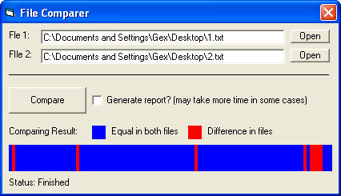



## File Comparer

### Description

This program compares two files by using binary access and when its done comparing it will give you graphical and textual report of file differences. Graphical report is not very precise when it comes to small files but textual report will give you exact byte differences. Its ment to be used on files of same size if it is suspected that one of them is corrupted or just different. This is why I actually created this program. I had two files corrupted at different places and I needed to combine them into one file without errors. To do this I needed to know where files are different. On my machine it took 3 min. and 5 sec. to compare two files of size 390 MB without using error report.

Unlike some other programs that compare files this one does not attempt to load files into memory array. Instead it uses buffers to read files, then compares the buffers then read in data again. Buffer size can be altered by changing the constant BUFFERSIZE.
 
### More Info
 

             |
---                |---
**Submitted On**   |2006-05-30 11:54:26
**By**             |[Gex](https://github.com/Planet-Source-Code/PSCIndex/blob/master/ByAuthor/gex.md)
**Level**          |Intermediate
**User Rating**    |3.7 (11 globes from 3 users)
**Compatibility**  |VB 5\.0, VB 6\.0
**Category**       |[Complete Applications](https://github.com/Planet-Source-Code/PSCIndex/blob/master/ByCategory/complete-applications__1-27.md)
**World**          |[Visual Basic](https://github.com/Planet-Source-Code/PSCIndex/blob/master/ByWorld/visual-basic.md)
**Archive File**   |[File\_Compa1997865312006\.zip](https://github.com/Planet-Source-Code/gex-file-comparer__1-65531/archive/master.zip)

